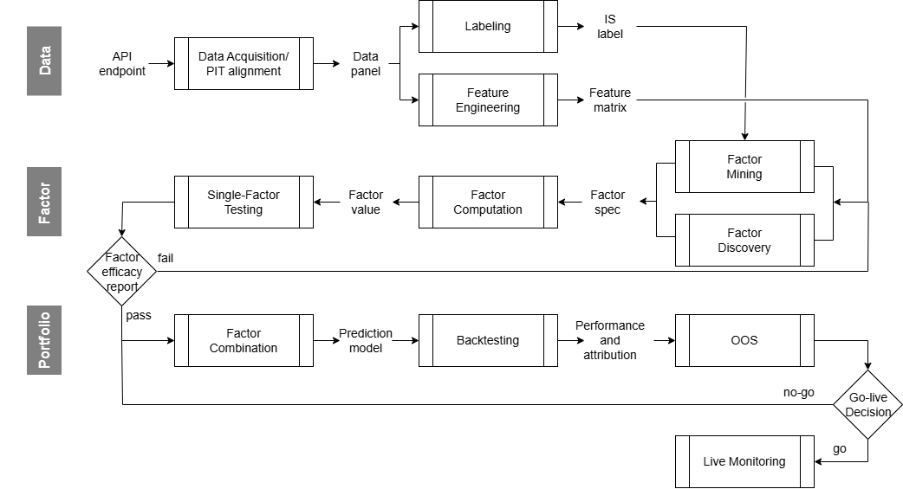

# Factor Research Process 

## Labs

- [Cross-Sectional Crypto Factor Research Lab](cross-sectional-crypto-factor-research-lab/): 10 種大市值加密貨幣的三因子橫截面研究
- [LLM Factor Discovery Lab](llm-factor-discovery-lab/): 使用 LLM 做因子假設與新聞特徵抽取

| Layer | Responsibility |
|---|---|
| **Data** | 產生乾淨、時序對齊、無 look-ahead bias 的 panel | 
| **Factor** | 產生因子，並驗證單一因子的預測力 | 
| **Portfolio** | 經由 backtesting、Out of Sample (OOS) 測試，把訊號轉成可執行，且扣除成本後仍成立的部位 | 

---

## Layer 1 — Data

### 1.1 Data Acquisition / PIT Alignment
從交易所或是其他外部來源取得原始資料，資料清洗之後做 point-in-time (PIT) 對齊，每一列只包含在該時間點可得的資訊，建立整條 pipeline 唯一事實的資料來源。準確的 PIT 對齊同時可防止後面階段的 look-ahead 偏誤。

**方法與工具**
- 範例: Binance REST API (OHLCV)、外部資料來源(如 SPY、on-chain、新聞文本)
- 範例: TEJ API、FinMind API
- `pandas` 做時間軸對齊、時區統一 (UTC+0)

**Input**
- API endpoint 與 API key
- universe 標的清單、時間範圍、bar timeframe 設定等等

**Output**
- `Data Panel`:以 `(timestamp, asset)` 為 key 的對齊 panel，含 OHLCV 與外部資料欄位
- 資料品質報告 (缺值率、異常 bar、來源覆蓋區間)

---

### 1.2 Labeling

標註預測目標 y，也就是因子公式要去對齊、要去預測的「答案」。定義想計算的 forward return 與 horizon 的設定。

**方法與工具**
- Forward return 計算: `(price_open(t+h+1) / price_open(t+1))-1`
- Horizon 設定與 rebalance frequency 一致

**Input**
- Data Panel (price)
- rebalance calendar、horizon 表

**Output**
- `In Sample (IS) label`: key 為 `(timestamp, asset, horizon)`，欄位包含 y = forward return
- 後續提供給 Factor Mining 模型使用

> **未來資訊只從 Labeling 一格進入。** 其餘所有格子嚴格只看過去。這讓 look-ahead 稽核變成單點檢查。

---

### 1.3 Feature Engineering

把 Data panel 轉成因子公式可以使用的特徵欄位。例如: 波動率、成交量分位、新聞情緒分數等等。

**方法與工具**
- Technical: `pandas` 計算 rolling 統計量、量價衍生欄位
- 另類資料類: LLM 結構化抽取特徵、embedding 等等

**Input**
- `Data Panel`

**Output**
- `Feature matrix`: key 為 `(timestamp, asset)` 的特徵表

---

## Layer 2 — Factor

### 2.1 Factor Mining

以 label 的目標函數為準，在公式空間中搜尋、產生候選因子。枚舉出人類想不到的因子。可解釋度較低。

**方法與工具**
- (WIP) Genetic programming、symbolic regression 等等
- 目標函數通常是 IS Rank IC 或 IS Sharpe

**Input**
- `Feature matrix`
- `IS label`(**只有 in-sample 切片**)

**Output**
- 候選因子池、factor specification (`Factor Spec`) 

---

### 2.2 Factor Discovery

從金融原理、機制出發，提出因子假設: 說明為什麼會有訊號，再寫下公式。可解釋性較高。

**方法與工具**
- 使用 LLM 提出假設: 每個假設因子須包含機制說明、time horizon、失效定義等等
- 人工 review 

**Input**
- `Feature matrix`
- 市場結構知識、文獻
- **不含 label、量化資訊**

**Output**
- 候選因子池、factor specification (`Factor Spec`)

---

### 2.3 Factor Computation

依 `Factor Spec` 公式，在 feature matrix 上算出每個因子的實際數值，將因子定義變成實際的公式以及數列。

**方法與工具**
- `pandas` 每個因子一支函式

**Input**
- `Factor Spec`
- `Feature matrix`

**Output**
- `Factor Value`:key 為 `(timestamp, asset, factor_id)` 的因子數值表

---

### 2.4 Single-Factor Testing

檢驗每個單一因子的預測力，在投入合成與回測成本之前，先篩掉沒有訊號的因子。

**方法與工具**
- Rank IC、IC IR、rolling IC 穩定性、Tercile spread、Factor spanning regression

**Input**
- `Factor Value`
- `IS label`

**Output**
- `Factor Efficacy Report`: 每因子的 IC / IR / spread / CI 統計表

---

## Layer 3 — Portfolio

### 3.1 Factor Combination

把通過的多個因子合成成訊號，並產生預測模型。

**方法與工具**
- rule-based: 等權、IC 加權
- model-based: LightGBM

**Input**
- 通過 gate 的 `Factor Value`
- 組合參數與部位限制條件

**Output**
- `Portfolio`: 每期的 target

---

### 3.2 Backtesting

以歷史價格回測此部位交易的結果 (含交易成本)。把訊號轉成可宣稱的報酬。

**方法與工具**
- 成本模型: 手續費 + 滑價 (以 round-trip bps 計)
- Rebalance 時點與 label horizon 必須一致

**Input**
- `Portfolio`
- `Data Panel`(價格路徑)
- 成本參數

**Output**
- `Performance and Attribution`: Sharpe、MDD、CAGR 等等

---

### 3.3 OOS

在 Out-of-Sample (OOS) 上檢驗前面所有決策 (因子選擇、參數、組合方式) 是否只是對 IS 的擬合。本階段不做參數調整。

**方法與工具**
- 樣本切片必須在研究開始前就切開並鎖住
- 比較 IS vs OOS 的 Sharpe 差異

**Input**
- OOS 切片的 `Data Panel`

**Output**
- OOS 績效 + IS/OOS 差異檢定結果

---

### 3.4 Go-live Decision (go/no-go)

綜合所有結果決定是否投入實盤。

**方法與工具**
- 決策清單:OOS Sharpe 門檻、最大可承載規模、與現有策略的相關性
- `no-go` → 回到 Factor Combination 重新配置
- `go` → 進入 Live Monitoring

**Input**
- OOS 績效、capacity 分析、成本敏感度

**Output**
- Go-live 決策紀錄 (含退回條件)

---

### 3.5 Live Monitoring

上線後持續追蹤實盤表現與因子訊號品質。偵測 factor decay、 實盤/回測落差，在虧損擴大前觸發下架。

**方法與工具**
- 實盤 vs 回測的逐期偏離追蹤 
- 因子 IC 的 rolling 監測

**Input**
- 實盤成交與部位紀錄
- 即時 `Factor Value`

**Output**
- 監控儀表板、decay 告警
